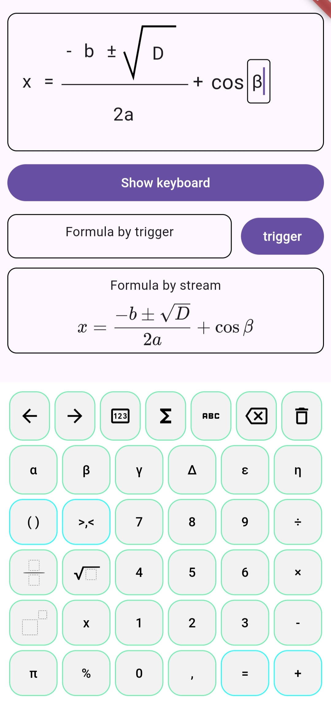
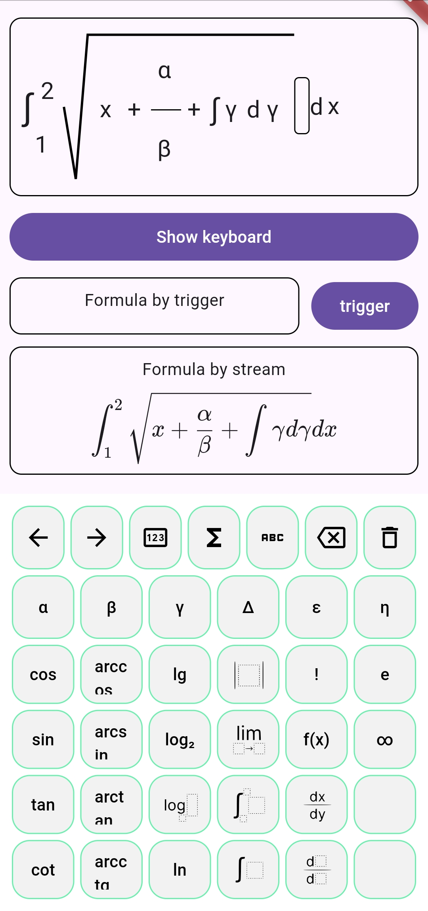

# Flutter Math Input 
Package for displaying, inputting, and outputting mathematical constructs in KaTeX


## Features

- Most of the most popular math constructs
- Flexible keyboard and math constructions, with the ability to create your own
- The ability to enter almost any basic formula
- KaTeX output by stream or getter




## Getting started

- Insert *MathController* by *ChangeNotifierProvider* into your widget tree.
````dart
ChangeNotifierProvider(
    create: (_) => MathController(),
    child: ...,
)
````
- Create *MathInput* widget under MathController init and provide to it keyboard (you can create our keyboard singelton by extanding *MathKeyboard* class or use BasicMathKeyboard)

````dart
MathInput(
    keyboard: BasicMathKeyboard(context: context)
)
````

## Available Constructs and Symbols

> *The package is under development, and bugs are not guaranteed to be absent.*

<summary>Fractions (frac)</summary>
<summary>Exponents (exp)</summary>


<summary>Brackets (buskets)</summary>

<details>
<summary>Trigonometric Functions</summary>
<ul>
<li>sin, arcsin</li>
<li>cos, arccos</li>
<li>tan, arctan</li>
<li>cot, arcctg</li>
</ul>
</details>
<details>
<summary>Logarithms</summary>
<ul>
<li>Natural logarithm (ln)</li>
<li>Binary logarithm (log2)</li>
<li>Common logarithm (log, lg)</li>
</ul>
</details>

<summary>Limits (lim)</summary>

<details>
<summary>Integrals (integral)</summary>
Definite and indefinite integrals.
</details>

<summary>Derivatives (derevative)</summary>

<summary>Absolute Value (abs)</summary>

<summary>Greek and English Alphabet</summary>

*<summary>Any your custom construction</summary>*

## Custom keyboard
You can create your custom keyboard: 
````dart
class CustomKeyboard extends MathKeyboard {
  CustomKeyboard({required super.context});
  
  @override
  Widget buildKeyboard(StateSetter setState) {
    // TODO: realize keyboard
  }

}
````

## Custom math constructions
1. Create your construction
````dart
clas MyCustomConstructions extends DefaultMathConstruction{
  MyCustomConstructions(super.builder);

  @override
  MathConstructionWidgetData createConstruction() {
    final field = builder.createTextField(
      replaceOldFocus: true, 
      isActive: true
    );
    final contruction = ColoredBox(
      key: builder.getKey(MyCustomConstructionKey()),
      color: Colors.red, 
      child: field
    );
    return MathConstructionWidgetData(construction: contruction);
  }

  @override
  MathConstructionKey get key => MyCustomConstructionKey();
}

class MyCustomConstructionKey extends SimpleMathConstructionKey{
  @override
  List<String> get katexExp => ['\\text{my custom construction:','}'];
}
````

2. Add to your keyboard
````dart
TextButton(
  onPressed: () => keyboardProperties.createDefaultFunc(MyCustomConstructions.new), 
  child: child
)
````